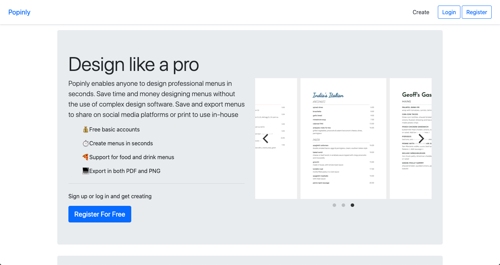

# Introduction

The goal of this project is to provide a minimalistic menu creation app that makes decent looking menus that everyone can use.

### Main features

* 6 Colour pallets and 10 Fonts

* Support for multi-page menus

* Export as Instagram Story

* Separated dev and production settings

* Bootstrap static files included

* User registration

* HTTPS provided by Heroku

* Procfile for easy deployments

* Separated requirements files

* SQLite by default if no env variable is set

# Usage

To use this template to start your own project:

This assumes that `python3` is linked to valid installation of python 3 and that `pip` is installed 

Installing inside virtualenv is recommended, however you can start your project without virtualenv too.

If you don't have django installed for python 3 then run:

    $ python3 -m venv .env
    $ source .env/bin/activate
    $ pip install -r requirements.txt
    
Then to build your local db:

    $ python3 manage.py makemigrations
    $ python3 manage.py makemigrations popinly
    $ python3 manage.py migrate

And finally

    $ python3 manage.py runserver